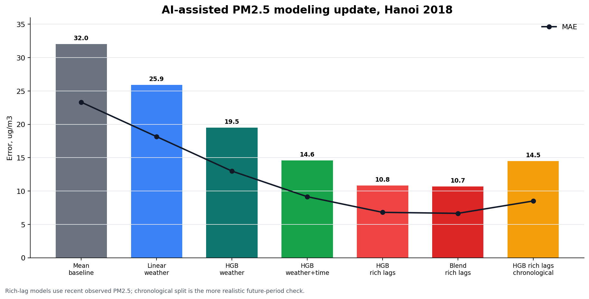

# air-quality-analysis
Jupyter notebooks and Python code for analyzing air quality (fine particles, PM<sub>2.5</sub>) 

# Table of contents

<a href="#1">1. Basic data visualization</a>  
<a href="#2">2. Correlation of PM<sub>2.5</sub></a>  
  <a href="#2.1">2.1 Correlation of PM<sub>2.5</sub> with time</a>  
    <a href="#2.2.1">2.2. Correlation of PM<sub>2.5</sub> with wind and temperature (data cleaning)</a>  
    <a href="#2.2.2">2.2. Correlation with wind and temperature (analysis)</a>  
  <a href="#2.3">2.3 Correlation with MERRA-2 data</a>  
  <a href="#2.4">2.4 Conversion wind (U,V) component, RH from temperatures </a>  
<a href="#3.1">3.1 Data selection</a>  
<a href="#3.2">3.2 Regression</a>  
<a href="#3.3">3.3 AI-assisted modeling update (2026)</a>  
<a href="#3.4">3.4 PM<sub>2.5</sub> forecasting experiments (2026)</a>  

<a href="#todo">TODO</a>  
<a href="#tools">Tool and packages</a>  
<a href="#credit">4. Credits</a>  

***PDF version is in PDF folder, likewise HTML's***

<a id="1"></a>
## 1. Basic data visualization
- introduce to basic setup of folder, install `pandas`, `matplotlib`, `seaborn` (using `pip` for Python package), `Anaconda` is a good choice if you are using Windows (or even Mac, Linux). Alternatively, try out [**Google Colaboratory**](https://colab.research.google.com/)
- basic use of those tools (clean, explore, plot, interpret)
- work with a CSV file from [Airnow.gov](https://www.airnow.gov/international/us-embassies-and-consulates/)
- here are some graphs produced from this exercise
  - basic line chart
  <p align="center">
    
  </p>
  
  - line chart with a band for standard deviation
  <p align="center">
    
  </p>
  - pie chart with Air Quality Index (AQI) 
  <p align="center">
    
  </p>

<a id="2"></a>
## 2. Correlation of PM<sub>2.5</sub>
<a id="2.1"></a>
### 2.1 Correlation of PM<sub>2.5</sub> with time
- continue to work with the .CSV file from **AirNow.Gov** to explore the correlation between PM<sub>2.5</sub> and time such as:
  - peak-traffic hours vs. non-peak traffic hours
  - weekends vs. weekdays
  - variation of each months
- here is some graphs produced from this exercise
  <p align="center">
    
  </p>
- a summary graph of this dataset
  <p align="center">
    
  </p>

<a id="2.2.1"></a>
### 2.2 Correlation of PM<sub>2.5</sub> with wind and temperature (data cleaning)
- explore data source (specifically working with archieved meteorologcal data from [NOAA.GOV](ncei.noaa.gov)
- clean the data (which is formatted with Integrated Surface Data (ISD) style)
- use `windrose` package to make windrose plot

  <p align="center">
    
  </p>

<a id="2.2.2"></a>
### 2.2 Correlation with wind and temperature (analysis)
- explore correlation between meteorological paramters to observed PM<sub>2.5</sub> concentration such wind, temperature, height above ground
- capture espisode and examine relevant inputs with PM<sub>2.5</sub>
- some examples from this exercise
  - correlation graph:
  <p align="center">
    
  </p>
  - what method in *that* correlation?
    <p align="center">
    
    </p>
  - a high PM<sub>2.5</sub> and a cloudy day
    <p align="center">
    
    </p>
  - or, I want to see other inputs such as.. 
  
    <p align="center">
    
    </p>
<a id="2.3"></a>
### 2.3 Correlation with MERRA-2 data
- work with [MERRA-2](https://gmao.gsfc.nasa.gov/reanalysis/MERRA-2/) reanalysis data from NASA
- find the correlation from main groups (single level, surface turbulent flux, aerosols mixing ratio) and PM<sub>2.5</sub>
- here is the 3 summary graphs:
  - Single level diagnosis
  <p align="center">
    
  </p>
  
  - surface turbulent flux
  <p align="center">
    
  </p>
  
  - Aerosol mixing:
  <p align="center">
    
  </p>

<a id="2.4"></a>
### 2.4 Conversion wind (U,V) component, RH from temperatures
- a detour to look at conversion of wind data (U, V) vectors to speed and direction in degree
- how to use **MetPy** packages calculate such conversion instead of manually undertake
- explore data for the next which is selecting relevant data for predicting PM<sub>2.5</sub>
- some graph examples:
    - relation of height (to the ground) vs. pressure
    <p align="center">
      
    </p>
    
    - compare values from different sources (such as from observed station, a public API, or reanalysis product)
      <p align="center">
        
      </p>
    
    - correlation of wind speed in different altitude to PM<sub>2.5</sub> concentration
      <p align="center">
        
      </p>
    
<a id="3.1"></a>
### 3.1 Data selection
- combine three sources of data fromt the previous exercise
  - PM<sub>2.5</sub> from airnow.gov
  - Ground observed data from ncei.noaa.gov
  - Reanalysis data from MERRA-2 product, SLV and FLX groups (or tags)
- remove dependent data and data with weak (very weak) correlation with PM<sub>2.5</sub>
- here is outcome of this exercise:
  - preliminary heatmap (of all most input parameters, don't worry about the name just yet):
      <p align="center">
        
      </p>
      
  
  - a final version of selected data with correlation with PM<sub>2.5</sub>
    <p align="center">
      
    </p>
      
  - and if you are curious about the full name of each parameter, here it is. Note that in the final version of CSV data, all temperature was converted from Kelvin (K) to Celsius (C).
   ```
   {'TQV': 'total_precipitable_water_vapor, kg m-2',
   'T2MDEW': 'dew_point_temperature_at_2_m, K',
   'HLML': 'surface_layer_height, m',
   'FRCAN': 'areal_fraction_of_anvil_showers, 1',
   'T2M': '2-meter_air_temperature, K',
   'WS': 'observed ground wind speed, m/s',
   'DISPH': 'zero_plane_displacement_height, m',
   'TQL': 'total_precipitable_liquid_water, kg m-2',
   'v_50m': 'wind speed at 50m, m/s',
   'v_850': 'wind speed at 850hPa (~1450m)',
   'v_2m': 'wind speed at 2m, m/s',
   'CLDCR': 'cloud cover, 1',
   'CIG': 'ceiling height dimension, m',
   'PS': 'surface_pressure, Pa',
   'RHOA': 'air_density_at_surface, kg m-3',
   'H1000': 'height_at_1000_mb, m'}
  ```
<a id="3.2"></a>
### 3.1 Regression
- Work with `Scikit-learn` library with regression models such Linear, DecisionTree, RandomForest
- Evaluate performance of each model and an ensamble by PM<sub>2.5</sub> and meteorological data for Hanoi, 2018. Datasets are cleaned and reduced from the previous excercise
- Apply a model with less feastures (DarkSky), but easiler to extract via API.
- Graphs from this excercise:
  - perfomance on train dataset (using ensemble regression)
    <p align="center">
      
    </p>
  
  - performance on test dataset 
    <p align="center">
      
    </p>

  - relative standard deviation on each model (lower is better)
  
  <p align="center">
    
  </p>
- an hourly update web-interface using the same concept can be found here with selected sites at my personal website [b-io.info](https://b-io.info/data/pm25-forecast/)
  - screenshot example:
  <p align="center">
    
  </p>
  
<a id="3.3"></a>
### 3.3 AI-assisted modeling update (2026)
- In 2026, the regression exercise was revisited with AI-assisted model review, clearer metrics, and additional experiments using the existing `data/comb_PM25_wind_Hanoi_2018_v3.csv` dataset.
- The update reports RMSE, MAE, and R<sup>2</sup>, and compares the original linear/random forest workflow with stronger tree ensembles, timestamp features, lagged PM<sub>2.5</sub>, and a chronological split check.
- The main modeling distinction is important:
  - weather-only models keep the original meteorological prediction task
  - timestamp features add hour/day/season information
  - lagged PM<sub>2.5</sub> features use recent observed PM<sub>2.5</sub>, so they should be described as short-horizon forecasting or nowcasting rather than pure weather-only prediction

  <p align="center">
    
  </p>

- Results from the updated notebook:
  - mean baseline: RMSE `32.045`, MAE `23.317`, R<sup>2</sup> `-0.001`
  - linear regression with weather features: RMSE `25.925`, MAE `18.156`, R<sup>2</sup> `0.345`
  - tuned weather-only histogram gradient boosting: RMSE `19.508`, MAE `12.992`, R<sup>2</sup> `0.629`
  - weather + timestamp features: RMSE `14.588`, MAE `9.148`, R<sup>2</sup> `0.793`
  - weather + timestamp + rich PM<sub>2.5</sub> lag features: RMSE `10.821`, MAE `6.801`, R<sup>2</sup> `0.883`
  - diagnostic rich-lag blend (`0.4 * HGB + 0.3 * RF + 0.3 * ExtraTrees`): RMSE `10.676`, MAE `6.652`, R<sup>2</sup> `0.886`
  - chronological future-period split with rich lag features: RMSE `14.488`, MAE `8.506`, R<sup>2</sup> `0.814`
- The lowest random-split RMSE in the updated notebook is about `10.7`, but the more conservative future-period estimate is about `14.5`.
- Notebook: [`3.3 AI-assisted modeling 2026.ipynb`](3.3%20AI-assisted%20modeling%202026.ipynb)

<a id="3.4"></a>
### 3.4 PM<sub>2.5</sub> forecasting experiments (2026)
- The 2026 follow-up also reframed the problem from "predict the exact PM<sub>2.5</sub> value" to more operational forecasting tasks:
  - severe event detection: whether PM<sub>2.5</sub> will exceed `100 ug/m3`
  - Vietnam AQI-style health region forecasting using PM<sub>2.5</sub> concentration bins
  - short-horizon bin forecasting using current PM<sub>2.5</sub>, recent PM<sub>2.5</sub> history, and Dark Sky weather fields as a forecast-weather proxy
- This is useful because exact PM<sub>2.5</sub> regression is difficult, while region-level forecasts can still support decisions such as "likely acceptable", "likely unhealthy", or "watch for a severe episode".

#### Severe event forecasting
- Target: `PM2.5(t + horizon) > 100 ug/m3`.
- Class frequency in the Hanoi 2018 dataset: `500 / 8116` hourly rows, or about `6.2%`.
- Because this class is rare, plain accuracy is not meaningful; precision, recall, F1, ROC-AUC, and average precision are more useful.
- Best 1-hour-ahead chronological result with weather, timestamp, and recent PM<sub>2.5</sub> lag features:
  - model: histogram gradient boosting
  - precision: `0.52`
  - recall: `0.69`
  - F1: `0.59`
  - ROC-AUC: `0.93`
  - average precision: `0.55`
- Longer horizon performance was lower but still showed signal:
  - 6-hour severe-event forecast: best F1 about `0.42`
  - 24-hour severe-event forecast: best F1 about `0.39`

#### Vietnam AQI region forecasting
- The Vietnam VN_AQI PM<sub>2.5</sub> 24-hour concentration ranges were used to create health-region labels:
  - `Tot`: `0-25 ug/m3`
  - `Trung binh`: `25-50 ug/m3`
  - `Kem`: `50-80 ug/m3`
  - `Xau`: `80-150 ug/m3`
  - `Rat xau`: `150-250 ug/m3`
  - `Nguy hai`: `>250 ug/m3`
- Weather-only region forecasting with MERRA-2 fields is possible, but it is harder than short-horizon forecasting with recent PM<sub>2.5</sub>. In chronological testing:
  - 6-region 24-hour forecast, best macro F1: `0.373`
  - 6-region 48-hour forecast, best macro F1: `0.239`
  - collapsed 3-region 24-hour forecast, best macro F1: `0.389`
  - collapsed 3-region 48-hour forecast, best macro F1: `0.383`
- Interpretation: MERRA-2 is useful for backtesting and meteorological context, but production forecasting should replace reanalysis weather with a forecast weather source using the same feature schema.

#### Short-horizon PM<sub>2.5</sub> bin forecasting with current PM<sub>2.5</sub> and Dark Sky
- For operational forecasting, the strongest setup used:
  - current PM<sub>2.5</sub>
  - recent PM<sub>2.5</sub> lag/rolling features
  - Dark Sky weather fields shifted to the forecast horizon as a proxy for available forecast weather
  - chronological train/test split
- PM<sub>2.5</sub> concentration bins:
  - Good: `<=25 ug/m3`
  - Acceptable: `25-50 ug/m3`
  - Unhealthy: `50-150 ug/m3`
  - Very unhealthy: `150-250 ug/m3`
  - Hazardous: `>250 ug/m3`
- Best chronological test results:

| Forecast horizon | Best model | Accuracy | Macro F1 | Weighted F1 |
|---:|---|---:|---:|---:|
| 6 hours | Random forest | `0.659` | `0.392` | `0.649` |
| 12 hours | Random forest | `0.592` | `0.354` | `0.586` |
| 24 hours | Random forest | `0.538` | `0.323` | `0.532` |
| 48 hours | ExtraTrees | `0.457` | `0.271` | `0.443` |
| 72 hours | balanced logistic regression | `0.376` | `0.230` | `0.354` |

- The 6-hour model is the most reliable. Accuracy depends strongly on whether the PM<sub>2.5</sub> condition remains in the same bin:
  - overall 6-hour accuracy: `65.9%`
  - currently Good: `72.1%` accuracy
  - currently Acceptable: `55.1%` accuracy
  - currently Unhealthy: `70.1%` accuracy
  - same-bin future hours: `84.0%` model accuracy
  - transition hours: `36.9%` model accuracy
- This means the model performs well when air quality is persistent, but transitions between bins remain the hard part.

#### What worked well
- Adding recent PM<sub>2.5</sub> state greatly improved short-horizon forecasts compared with weather-only models.
- Tree ensembles, especially random forest, ExtraTrees, and histogram gradient boosting, handled nonlinear weather and persistence patterns better than plain linear models.
- Forecasting bins or health regions is easier to explain than exact PM<sub>2.5</sub> regression and is closer to operational use.
- MERRA-2 variables such as pressure, temperature, total precipitable water vapor, height fields, and wind-related variables explain useful background meteorology.
- Dark Sky-style weather fields are a practical template for production inputs because real forecast APIs can provide similar variables.

#### What needs improvement
- The model still struggles with transitions, especially Good -> Acceptable/Unhealthy and Acceptable -> Unhealthy.
- Very unhealthy and hazardous classes are too rare in the 2018 dataset to learn robustly. The dataset has only `88` very unhealthy hourly samples and `3` hazardous samples after binning.
- Longer horizons, especially 48-72 hours, need stronger forecast-weather features, more years of data, and possibly regional transport features.
- Current experiments use one Hanoi PM<sub>2.5</sub> monitor and one year of data. A more robust model should include multiple years, nearby stations, emissions/traffic proxies, wind direction transport features, and external fire/dust indicators.
- For production, MERRA-2 should be used for historical backtesting, while weather forecast data should be used for live predictions.
- The most useful output should be probabilities for each bin at each horizon, not just one hard class. For example: `+24h Good 12%, Acceptable 31%, Unhealthy 52%, Very unhealthy 5%, Hazardous <1%`.

- Result tables:
  - `data/adverse_event_model_results_2026_light.csv`
  - `data/vn_aqi_region_forecast_results_2026.csv`
  - `data/vn_aqi_region_forecast_results_2026_collapsed.csv`
  - `data/darksky_pm25_bin_forecast_results_2026.csv`
  
<a id='tools'></a>
## tools and packages
- the analysis is carried out on Jupyter Notebook (and later with Jupyter Lab 2.2), Ubuntu 18.04LTS. 
- Python (3.6.9)
- Matplotlib (3.1.2)
- pandas (1.1.0)
- Seaborn (0.9.0)
- windrose (N/A)
- MetPy (1.0.0)
- scikit-learn (sklearn - 0.22.1)
- scipy (1.4.1)
- 2026 AI-assisted modeling update: Python 3.10, pandas 2.3.1, scikit-learn 1.7.2, Matplotlib 3.10.9

<a id="credit"></a>
## Credits:
- some of the writing and coding are carried out while I were working with [PAM Air](https://pamair.org) project.  I appreciate the flexiblity from the management so that I can make this happen.
- Books: 
  - [Python for Data Analysis: Data Wrangling with Pandas, NumPy, and IPython by Wes McKinney](https://www.amazon.com/Python-Data-Analysis-Wrangling-IPython)
  - [Hands-On Machine Learning with Scikit-Learn and TensorFlow, Aurélion Géron](https://www.oreilly.com/library/view/hands-on-machine-learning/9781491962282/)
- Tutorials:
  - [Chris Albon with techniques working with dataframe](https://chrisalbon.com/python/data_wrangling/pandas_group_data_by_time/)
  - [Towards Data Science, many topics, quality varied](https://towardsdatascience.com/)

## If this work is helpful to your research
- Admittedly, citing Github repository or other open project is new, but if this work is helpful for your work, I would appreciate the attribution, a link or a word.
- To cite this work, use this `Binh Nguyen, Air Quality Analysis, GitHub repository: https://github.com/binh-bk/air-quality-analysis`

<a id="todo"></a>
# TODO
### Keras (with TensorFlow)
- experiment with LSTM is not yet promising.
